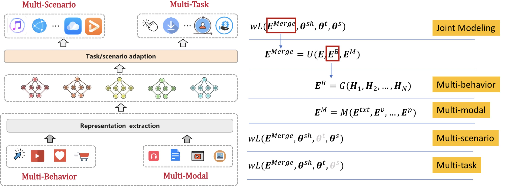

 

## Abstract

In the current digital era, Deep Recommender Systems (DRS) are essential for navigating and tailoring online content to individual preferences. However, conventional approaches that rely primarily on a single recommendation task, scenario, data modality, or user behavior are increasingly inadequate for capturing users' complex and evolving preferences. This limitation highlights the need for joint modeling approaches that integrate multiple tasks, scenarios, modalities, and behaviors within the recommendation process, enhancing recommendation precision, efficiency, and personalization. In this tutorial, we aim to give a comprehensive survey on the recent progress of the joint modeling methods in recommendations, which includes multi-task, multi-scenario, multi-modal, and multi-behavior modeling. This work will provide academic researchers and industry professionals with a thorough understanding and clear insight into these areas, sparking new ideas, fostering discussions, and driving technological advancements in the field of deep recommender systems.

## Presenters

<table style="border: none;">
<tbody style="border: none; margin-left: auto; margin-right: auto;">

<tr style="border: none;">
<td align="center" style="width: 200px;" >

</td>
<td align="center" style="width: 200px;">

</td>
<td align="center" style="width: 200px;">

</td>
<td align="center" style="width: 200px;">

</td>
<td align="center" style="width: 200px;">

</td>
</tr>

<tr  style="border: none;">
<td align="center">
<b>Pengyue Jia</b>
</td>
<td align="center">
<b>Jingtong Gao</b>
</td>
<td align="center">
<b>Yuhao Wang</b>
</td>
<td align="center">
<b>Xiaopeng Li</b>
</td>
<td align="center">
<b>Qidong Liu</b>
</td>
</tr>

<tr style="border: none;">
<td align="center" style="width: 200px;" >

</td>
<td align="center" style="width: 200px;">

</td>
<td align="center" style="width: 200px;">

</td>
<td align="center" style="width: 200px;">

</td>
</tr>

<tr  style="border: none;">
<td align="center">
<b>Yichao Wang</b>
</td>
<td align="center">
<b>Bo Chen</b>
</td>
<td align="center">
<b>Huifeng Guo</b>
</td>
<td align="center">
<b>Ruiming Tang</b>
</td>
</tr>

</tbody>
</table>

## Overview of Joint Modeling

## Target Audience

Given the focus of the tutorial, we anticipate participants
from academic institutions, industrial research labs, as
well as start-ups to be interested in participating in the
tutorial. The audience is expected to have basic understanding
of data mining and machine learning. However, the tutorial will be presented at the college junior/senior
level and should be comfortably followed by academic researchers
and practitioners from the industry.

## Video teaser

<!-- <video weight="320" height="320" Poster="./imgs/teaser_poster.png" controls autoplay> -->
<video weight="320" height="320" controls>
  <source type="video/mp4" src="./imgs/video_teaser.mp4">
</video>

## Schedule

TBA

## Acknowledgements

This research was partially supported by Research Impact Fund (No.R1015-23), Collaborative Research Fund (No.C1043-24GF), APRC - CityU New Research Initiatives (No.9610565, Start-up Grant for New Faculty of CityU), Hong Kong ITC Innovation and Technology Fund Midstream Research Programme for Universities Project (No.ITS/034/22MS), Huawei (Huawei Innovation Research Program), Tencent (CCF-Tencent Open Fund, Tencent Rhino-Bird Focused Research Program), Ant Group (CCF-Ant Research Fund), Alibaba (CCF-Alimama Tech Kangaroo Fund No. 2024002), and Kuaishou.
